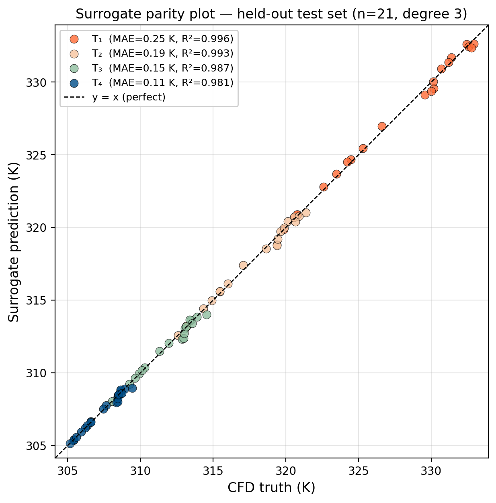

# ☀️ Solar Dryer Digital Twin

> **A CFD-trained machine-learning surrogate that predicts agricultural-dryer tray temperatures, drying time, and thermal efficiency in under 1 ms — replacing simulations that take hours.**

[](https://solar-dryer-twin-ggttzp5xh22cbrjswcjnql.streamlit.app/)
[](https://solar-dryer-twin.onrender.com/docs)
[-blue?style=for-the-badge)](Solar_Dryer_Digital_Twin_Project_Report.pdf)

[](https://www.python.org/)
[](https://fastapi.tiangolo.com/)
[](https://streamlit.io/)
[](https://scikit-learn.org/)
[](Dockerfile)
[](#license)

> **CLL251 — Heat Transfer for Chemical Engineers · IIT Delhi (2026)**
> *Eric Kapil · Vedant Singhal · Kridant Kumar · Tanisha Sangwan*

---

## 🎯 What it does

Smallholder farmers, dryer designers, and agricultural extension workers all need to answer the same question:

> **"What will my dryer do under tomorrow's weather?"**

High-fidelity CFD answers it correctly but takes hours per case. Reduced-order analytical models are fast but disagree with CFD by 10–20 %. We built a **four-layer thermal-modelling stack** that captures CFD-quality physics in a 4 KB polynomial that runs in under a millisecond — and wrapped it in a real-time web dashboard.

| Layer | Tool | Speed | Accuracy |
|---|---|---|---|
| 1. Analytical lumped balance + dimensionless analysis | NumPy | Instant | Trend only |
| 2. 1-D Finite Difference Method (transient absorber plate) | NumPy | < 1 s | ± 12 K vs CFD |
| 3. 3-D Computational Fluid Dynamics | Ansys Fluent | **~hours** | Ground truth |
| 4. **Polynomial-regression surrogate** | scikit-learn | **< 1 ms** | **MAE < 0.25 K, R² > 0.98** |

---

## 📊 Validation receipts

<p align="center">
  
</p>

| Tray | R² | MAE (K) | Status |
|---|---|---|---|
| T₁ (bottom, hottest) | 0.996 | 0.248 | ✅ |
| T₂ | 0.993 | 0.191 | ✅ |
| T₃ | 0.987 | 0.154 | ✅ |
| T₄ (top, coolest) | 0.981 | 0.114 | ✅ |

Trained on 81 / tested on 21 design points from a parametric Ansys Fluent sweep across 300–800 W/m² × 0.50–0.90 porosity (102 design points total).

---

## 🚀 Try it

| | Link |
|---|---|
| **Live dashboard** | <https://solar-dryer-twin-ggttzp5xh22cbrjswcjnql.streamlit.app/> |
| **Live API (Swagger UI)** | <https://solar-dryer-twin.onrender.com/docs> |
| **Project report (7 pp.)** | [`Solar_Dryer_Digital_Twin_Project_Report.pdf`](Solar_Dryer_Digital_Twin_Project_Report.pdf) |

The dashboard is a **5-tab Streamlit app**:

1. **🌡️ Live Twin** — slider-driven tray temperatures, drying time, thermal efficiency, live dimensionless-group panel (Bi, Re, Ra, Pr, Nu)
2. **🔬 1D FDM** — transient absorber-plate solver at three irradiance levels (reproduces Fig. 1 of the report)
3. **📈 Parametric Sweeps** — heat-flux and porosity scans showing the monotonic descent T₁ > T₂ > T₃ > T₄
4. **✅ Validation** — per-tray R²/MAE table + four-layer modelling-stack diagram
5. **💰 Economics** — cost-per-batch comparison vs diesel-fired and electric-resistance drying

> **Heads-up:** the API runs on a free Render dyno that sleeps after 15 min of inactivity, so the **first request can take ~30 s to wake up**. Subsequent calls are < 100 ms.

---

## 🏗️ Architecture

```
                ┌────────────────────────────┐
                │  Streamlit dashboard       │  ← public, anyone with the URL
                │  (Streamlit Community Cloud)│
                └──────────────┬─────────────┘
                               │  HTTPS · JSON
                               ▼
                ┌────────────────────────────┐
                │  FastAPI service           │
                │  (Docker on Render)        │
                └──────────────┬─────────────┘
                               │
        ┌──────────────────────┼──────────────────────┐
        ▼                      ▼                      ▼
  ┌─────────────┐      ┌─────────────┐         ┌─────────────┐
  │ Surrogate   │      │ Physics     │         │ Redis cache │
  │ (joblib,    │      │ - wind corr │         │ (LRU,       │
  │  4 KB poly) │      │ - Lewis     │         │  best-effort)│
  └─────────────┘      │   kinetics  │         └─────────────┘
                       │ - efficiency│
                       └─────────────┘
                              │
                              ▼
                       ┌─────────────┐
                       │  Postgres   │
                       │  (audit +   │
                       │   analytics)│
                       └─────────────┘

Offline:  CFD CSV ──► train_surrogate.py ──► models/surrogate-v{N}.joblib
```

### Data flow (single request)
1. `POST /v1/simulate` → pydantic validates against the CFD sweep envelope.
2. Cache key `pred:{model_version}:{round(I,2)}:{round(ϕ,2)}` — hit returns in < 5 ms.
3. Surrogate emits 4 tray temperatures (K).
4. Physics layer applies wind correction (flat-plate Nu) and Lewis-Arrhenius drying kinetics.
5. Row appended to `predictions` table (training-data flywheel).
6. JSON response.

---

## 📡 API

| Verb | Path | Purpose |
|---|---|---|
| `GET`  | `/healthz` | liveness |
| `GET`  | `/readyz`  | model + DB + Redis readiness |
| `GET`  | `/metrics` | Prometheus scrape |
| `POST` | `/v1/predict`  | tray temps only |
| `POST` | `/v1/simulate` | tray temps + drying time + efficiency |
| `POST` | `/v1/fdm/transient` | 1-D plate transient + Bi/Pr/h_eff |
| `GET`  | `/v1/predictions/recent?limit=N` | audit feed |

OpenAPI / Swagger UI at [`/docs`](https://solar-dryer-twin.onrender.com/docs).

### Example — `POST /v1/simulate`
```bash
curl -X POST https://solar-dryer-twin.onrender.com/v1/simulate \
     -H 'content-type: application/json' \
     -d '{"heat_flux":600,"porosity":0.7,"ambient_c":25,"wind_mps":2,"crop":"tomato"}'
```
```json
{
  "temps": { "t1_c": 50.3, "t2_c": 41.6, "t3_c": 36.4, "t4_c": 32.9 },
  "wind_correction_k": 1.34,
  "trays": [
    { "tray": 1, "temp_c": 50.3, "drying_time_hours": 9.2, "rate_constant_per_hour": 0.51 },
    ...
  ],
  "thermal_efficiency": 0.42,
  "model_version": "v1"
}
```

---

## 🧰 Tech stack

| Concern | Choice | Why |
|---|---|---|
| Inference | scikit-learn polynomial pipeline (in-process) | Model is 4 KB; the network hop to a model server costs more than the math |
| API | FastAPI + uvicorn | Async, pydantic validation, free OpenAPI docs |
| Cache | Redis LRU | Rounded inputs → very high hit rate; survives pod restart |
| DB | Postgres (SQLite fallback) | Fixed schema, queries on `(I, ϕ)` distribution |
| Telemetry | Prometheus `/metrics` | Counters + latency histogram per route |
| Container | `python:3.12-slim`, non-root | Small attack surface, k8s-friendly |
| Frontend | Streamlit + Plotly | Slider-to-prediction in < 100 ms, zero JS |
| Hosting | Streamlit Community Cloud (frontend) + Render (API) | Free tier, GitHub-driven CI |

---

## 💻 Local development

```bash
# 1.  Train the surrogate from the CFD dataset
python -m app.train.train_surrogate \
       --csv Data_Raw/solar_dryer_ml.csv \
       --out models/surrogate-v1.joblib

# 2.  Start API + Redis + Postgres
docker compose up --build

# 3.  Hit the endpoint
curl -X POST localhost:8000/v1/simulate \
     -H 'content-type: application/json' \
     -d '{"heat_flux":700,"porosity":0.7,"ambient_c":28,"wind_mps":3,"crop":"tomato"}'

# 4.  Run the Streamlit frontend (separate terminal)
streamlit run frontend/legacy_streamlit/streamlit_app.py
```

### Tests
```bash
pytest tests/test_physics.py    # pure-function checks, no deps
pytest tests/test_surrogate.py  # needs CSV
pytest tests/test_api.py        # needs model + redis + postgres
```

---

## 📂 Repo layout

```
app/                         FastAPI service
  api/                       routes_health · routes_predict · routes_simulate · routes_fdm
  services/                  surrogate · physics · cache · fdm
  db/                        SQLAlchemy session, models, CRUD
  train/                     CSV → joblib + metrics.json (R²/MAE gate)
frontend/legacy_streamlit/   Streamlit dashboard (5 tabs)
models/                      Trained surrogate (.joblib + metrics.json)
figures/                     Parity plot, FDM transient curves
docs/                        Heat-transfer derivations
Data_Raw/                    102-point CFD CSV + Ansys screenshots
tests/
Dockerfile · docker-compose.yml · requirements.txt
Solar_Dryer_Digital_Twin_Project_Report.pdf
```

---

## 👥 Author contributions

| Author | Role |
|---|---|
| **Eric Kapil** | CFD parametric sweep (Ansys Fluent, 102 design points), ML training pipeline, original draft |
| **Vedant Singhal** | FastAPI backend, Streamlit frontend, ML training pipeline, deployment |
| **Kridant Kumar** | Heat-transfer derivations (lumped capacitance, dimensionless groups, Lewis kinetics), review & editing |
| **Tanisha Sangwan** | FDM solver implementation, validation cross-checks, parity plot, contour visualisations |

---

## 📄 License

This repository is an academic deliverable for **CLL251 · IIT Delhi (2026)** and is kept as a portfolio snapshot.
Source code is provided as-is for educational reference. Cite the project report when reusing the modelling stack.

---

<p align="center">
  <a href="https://solar-dryer-twin-ggttzp5xh22cbrjswcjnql.streamlit.app/">
    
  </a>
</p>
